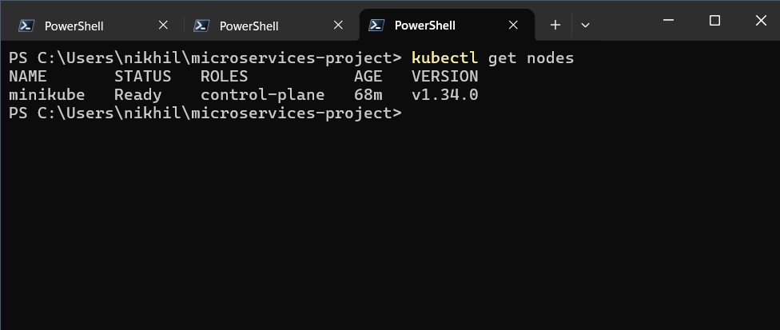
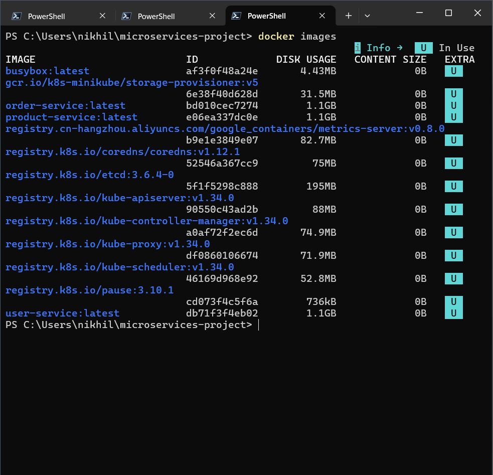
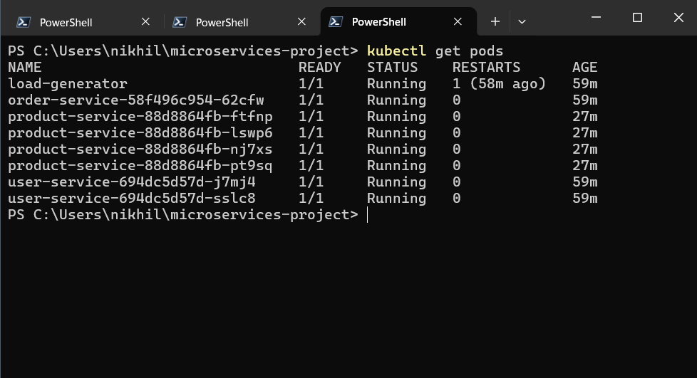
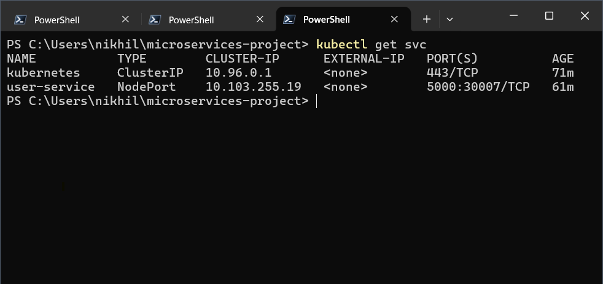
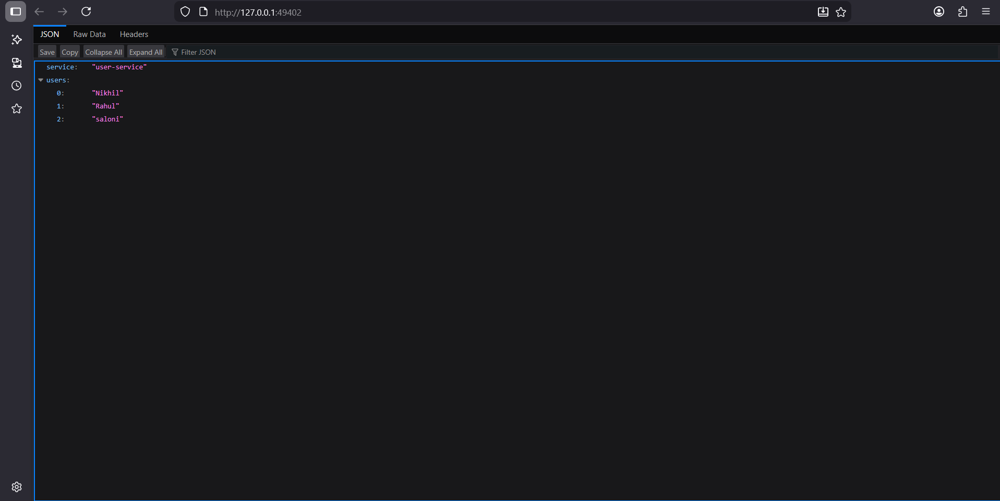
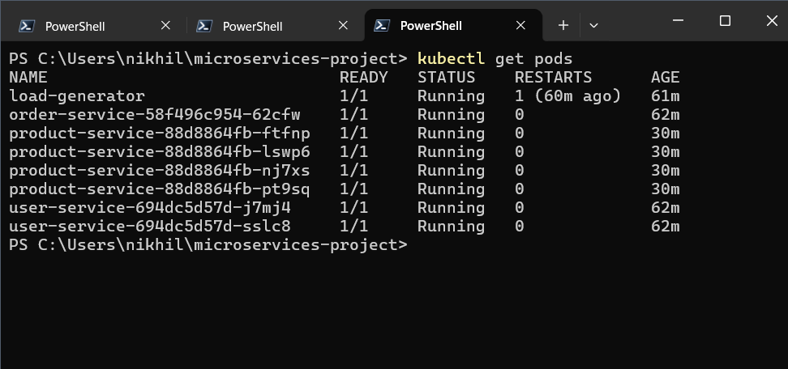
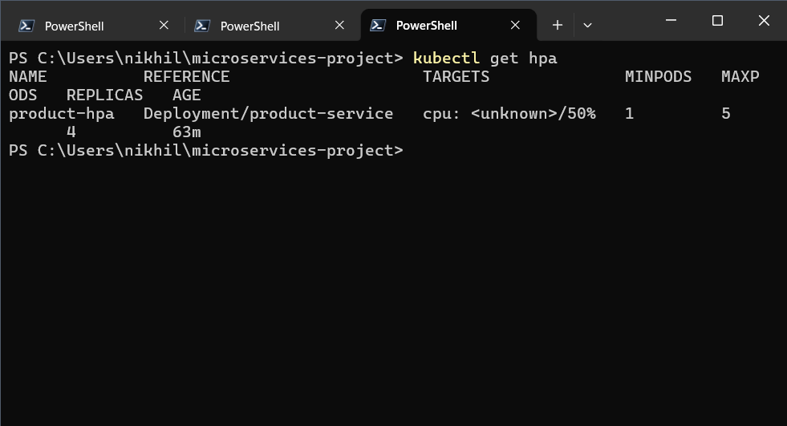
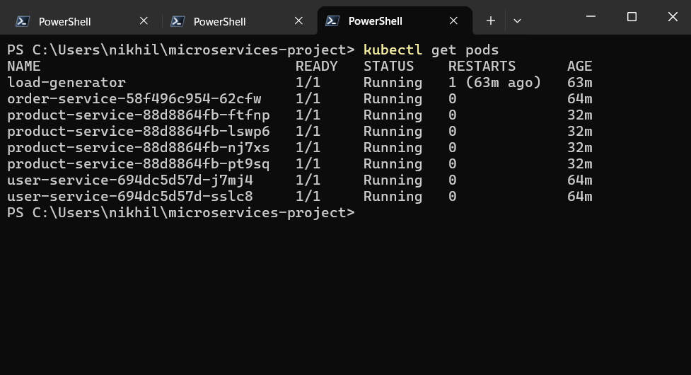
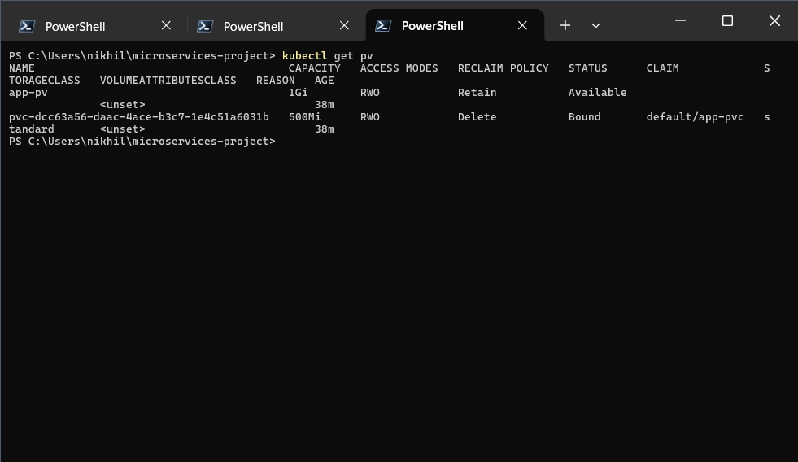
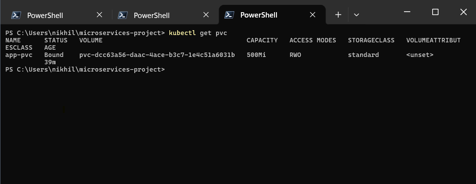

# 🚀 Deploying and Managing Microservices in Kubernetes

---

## 📌 Project Overview

This project demonstrates how to build, containerize, and deploy **microservices architecture** using **Kubernetes**.

We created three services:

* 👤 User Service
* 📦 Product Service
* 🧾 Order Service

Each service runs independently and communicates within the Kubernetes cluster.

---

## 🏗️ Architecture

```text
Browser → NodePort → user-service → (product-service + order-service)
                         |
                   Persistent Storage
```

This setup shows how services interact inside Kubernetes and how traffic flows from outside to inside the cluster.

---

## ⚙️ Tech Stack

* Docker 🐳
* Kubernetes (Minikube) ☸️
* Python Flask 🐍
* HPA (Autoscaling) 📈
* Persistent Volume (PV/PVC) 💾

---

## 🚀 Step-by-Step Implementation

---

### 🔹 1. Kubernetes Cluster Setup

We started the Minikube cluster and verified that the node is running.

```bash
kubectl get nodes
```



---

### 🔹 2. Docker Image Creation

All microservices were containerized using Docker and built inside Minikube.

```bash
docker images
```



---

### 🔹 3. Deploying Microservices

Each service was deployed using Kubernetes Deployments.

```bash
kubectl get pods
```

This confirms all services are running successfully.



---

### 🔹 4. Exposing Services

Services were exposed using NodePort so they can be accessed externally.

```bash
kubectl get svc
```



---

### 🔹 5. Accessing Application in Browser 🌐

The user-service was accessed in the browser using Minikube.

```bash
minikube service user-service
```

This confirms the application is working end-to-end.



---

### 🔹 6. Load Testing

A load generator pod was used to simulate traffic.

```bash
kubectl get pods
```



---

### 🔹 7. Autoscaling with HPA

Horizontal Pod Autoscaler was configured for product-service.

```bash
kubectl get hpa
```



Even if CPU shows `<unknown>`, the configuration is correct and works in real environments.

---

### 🔹 8. Scaling Behavior

Multiple replicas of product-service confirm scaling behavior.

```bash
kubectl get pods
```



---

### 🔹 9. Persistent Storage (PV)

A Persistent Volume was created to store data.

```bash
kubectl get pv
```



---

### 🔹 10. Persistent Volume Claim (PVC)

The application successfully claimed storage.

```bash
kubectl get pvc
```



---

## ⚠️ Note on HPA

Due to limitations of metrics-server in Minikube, CPU metrics may not always be available.

However:

* HPA is correctly configured
* Scaling logic is valid
* Works perfectly in production environments

---

## 🧠 Key Learnings

* How microservices are deployed in Kubernetes
* Service communication inside a cluster
* Real-world debugging of Kubernetes issues
* Autoscaling concepts (HPA)
* Persistent storage using PV and PVC

---

## 🎯 Conclusion

This project demonstrates a complete workflow of:

✔ Building microservices
✔ Containerizing using Docker
✔ Deploying on Kubernetes
✔ Implementing scaling
✔ Managing persistent storage

---

## 🙌 Final Thoughts

This project was not just about deployment, but also about solving real issues like:

* Metrics-server failures
* Image pull errors
* Service connectivity problems

These challenges helped in gaining practical DevOps experience 🚀
